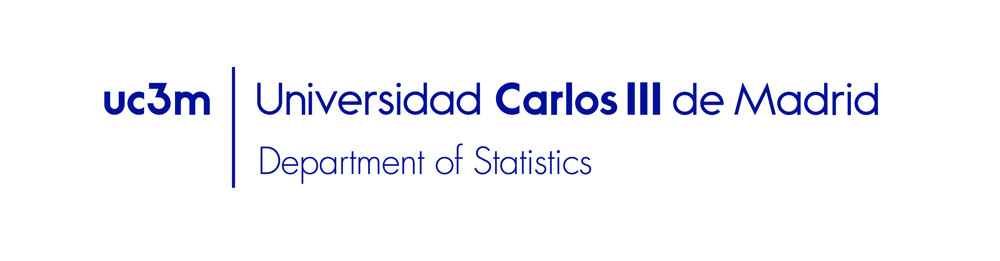
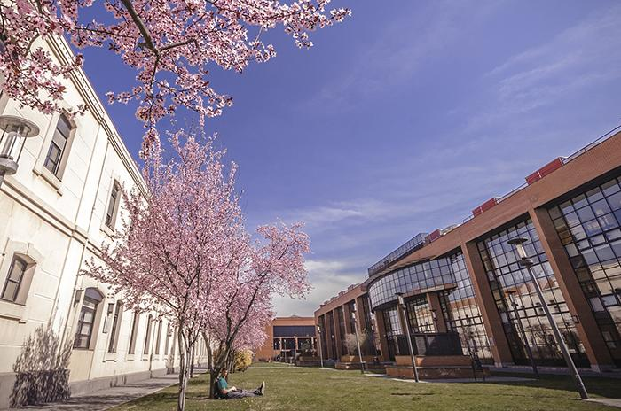
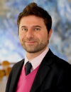
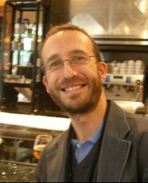
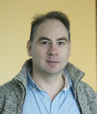
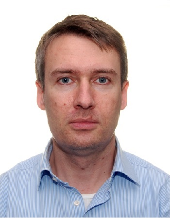
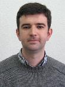
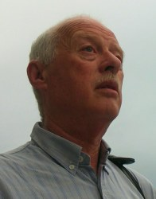

## Scope

Conferences and discussions with some of the current leading experts in **Nonparametric Statistics**, held in the [Department of Statistics](http://portal.uc3m.es/portal/page/portal/dpto_estadistica/home) of [Carlos III University of Madrid](http://www.uc3m.es). 

 

<i>The Department of Statistics at UC3M (Getafe)</i>

 

## Speakers

| Speaker | Affiliation | Date | Topic |
|:-------:|:-----------:|:----:|:-----:|
|  [Davide La Vecchia](http://unige.ch/gsem/rcs/members2/profs/d/) | Université of Genéve (Switzerland) | Friday 3rd | TBA |
|  [Thomas Verdebout](http://tverdebo.ulb.ac.be/) | Université libre de Bruxelles (Belgium) | Wednesday 8th | TBA |
 [Jacobo de Uña](http://jacobo.webs.uvigo.es/) | Universidad de Vigo (Spain) | Friday 10th | TBA |
|  [Javier Cárcamo](http://www.uam.es/personal_pdi/ciencias/jcarcamo/) | Universidad Autónoma de Madrid (Spain) | Wednesday 15th | TBA |
|  [Siegfried Hörmann](http://homepages.ulb.ac.be/~shormann/) | Université libre de Bruxelles (Belgium) | Friday 17th | TBA |
 [Eustasio del Barrio](http://www.eio.uva.es/infor/personas/tasio.html) | Universidad de Valladolid (Spain) | Wednesday 22th | TBA |
 [Ricardo Fraiman](http://www.cmat.edu.uy/cmat/docentes/rfraiman) | Universidad de la República (Argentina) | Friday 24th | TBA |

## Location

Seminars to be held in *Sala Costas Goutis* 10.0.23 (Getafe) at **13:00**. The is located at the ground floor of building 10 (*Campomanes*). The exact coordinates are given in the map below.

 

 

## Registration

No prior registration is required. Attendance is free of charge. 

## Organization

- Scientific comittee: Antonio Cuevas, Marc Hallin, and Daniel Peña.
- Organizing comittee: Eduardo García Portugués, Raúl Jiménez Recaredo (chair) and Susana Linares (secretary).

## Contact

In case of questions you may contact <edgarcia@est-econ.uc3m.es>.
